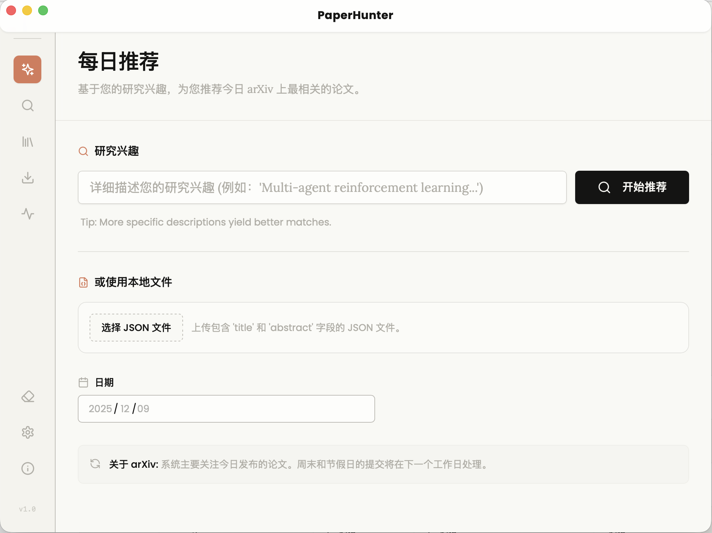

<div align="center">

# PaperHunter

</div>

**多平台学术论文爬取与语义搜索工具**



[](LICENSE)

<div align="center">

**如果这个项目对你有帮助，请给一个 ⭐️ Star！**

</div>


<div align="center">

你可以在[这里](https://www.douyin.com/video/7578161371604089792)听到我关于这个项目的简要介绍

</div>


<div align="center">

### 需要注意的是， 现在的 0.0.1 版可能充满了 bug。

</div>

>
> TODO: 根据设定的关键词或者 examples 每日定时抓取可能会感兴趣的论文摘要
>
> TODO: 添加 config 支持代理池部分，配置 proxy = true or false 来解决 ssrn 的限流问题
>
> TODO: Download 部分，去设计一个下载对应的 pdf 然后对对应目录下的所有 pdf 做 deep reaserch 的页面
>
> TODO：考虑接入 firecrawl 从而增加更多平台适配性

## 📖 简介

PaperHunter 是一个高效、灵活的多平台学术论文爬取与语义搜索工具。基于我之前的小项目 QuickArxiv 的实践演进而来，支持从多个学术平台按关键词、类别、时间范围抓取论文，利用 Embedding 技术进行语义相似度检索，并支持多种格式导出。

### ✨ 核心特性

-  **多平台支持**：目前支持 arXiv、OpenReview，后续将扩展 ACL Anthology、DBLP、Semantic Scholar 等平台
-  **灵活查询**：支持关键词、类别、日期范围等多维度过滤
-  **语义搜索**：基于 Embedding 向量的相似度检索，支持文本查询和示例论文搜索
-  **本地存储**：使用 SQLite 进行高效数据持久化，支持向量缓存
-  **多格式导出**：支持 CSV、JSON 等格式导出，支持 Zotero 同步
-  **数据管理**：灵活的数据清理工具，支持按时间、来源、embedding 状态等条件清理
-  **易于扩展**：模块化设计，平台插件化，易于添加新数据源

## 🚀 快速开始

### 安装

从 [Releases](https://github.com/cry0404/PaperHunter/releases) 页面下载对应平台的安装包（macOS/Windows）。

### 配置

1. 启动应用，进入 **Settings** 页面。
2. **Embedding / LLM（必填）**
   - BaseURL：兼容 OpenAI 格式的推理/向量地址（如 SiliconFlow / DeepSeek）。
   - API Key：对应服务的密钥。
   - ModelName：例如 `text-embedding-3-small`（向量）或 `gpt-4o-mini`（LLM）。
3. **数据库**
   - Path：本地数据文件路径（默认 `~/.quicksearch/quicksearch.db`）。
4. **Zotero（可选，用于 Zotero 导出/每日推荐种子）**
   - User ID：Zotero 个人或群组 ID。
   - API Key：Zotero 生成的 API Key。
   - Library Type：`user` 或 `group`。
5. **飞书（可选，用于导出到多维表格）**
   - App ID / App Secret：在飞书开放平台创建自建应用后获取。
6. **平台配置（Settings 页内）**
   - 代理：如果需要通过代理访问（如 OpenReview / SSRN），在系统代理中配置并在平台设置中开启。
   - 超时时间：根据网络情况调整。
   - ACL：可切换 `Use RSS`（默认，最新 1000 篇）或 `Use BibTeX`（全量，含摘要）。
   - OpenReview：填写 Venue ID（例如 `ICLR.cc/2026/Conference/Submission`）。
7. 保存设置后再进行爬取/推荐/搜索。

### 功能概览

#### 1. Daily Recommendations (每日推荐)
基于您的 Zotero 库（需要配置 Zotero API）或输入的兴趣关键词，为您推荐指定日期范围内新发布的相似论文。这是获取每日最新科研动态的最佳方式。

#### 2. Search Papers (语义搜索)
执行基于 Embedding 的语义搜索：
- **文本查询**：输入自然语言描述寻找相关论文。
- **以文搜文**：输入示例论文的标题或摘要，寻找相似论文。
- **混合筛选**：结合时间范围、来源平台进行精确筛选。

#### 3. Crawl Papers (论文爬取)
批量爬取特定领域的论文：
- **arXiv**: 支持按关键词、类别、日期范围爬取。
- **OpenReview**: 支持按会议 ID (Venue ID) 爬取。
- **ACL / SSRN**: 支持更多专业平台的检索。

#### 4. Export (导出)
支持多种格式导出选中的论文：
- **Zotero**: 直接同步到 Zotero 收藏夹。
- **飞书多维表格**: 导出到飞书，便于团队协作，添加 a few shot 分析。
- **CSV / JSON**: 通用数据格式导出。

## 开发指南

### 本地开发

本项目使用 [Wails](https://wails.io/) 框架构建。

1. 安装 Go (1.21+) 和 Node.js (18+)。
2. 安装 Wails CLI: `go install github.com/wailsapp/wails/v2/cmd/wails@latest`
3. 克隆仓库并进入目录。
4. 运行开发模式：

```bash
wails dev
```

### 添加新平台

1. 在 `internal/platform/<platform_name>/` 创建新目录
2. 实现 `Platform` 接口：

```go
type Platform interface {
    Name() string
    Search(ctx context.Context, q Query) (Result, error)
}
```

3. 实现平台特定的解析器和客户端
4. 在 `internal/core/registry.go` 中注册新平台
5. 更新配置文件添加平台配置


## 🤝 贡献

欢迎贡献代码、报告问题或提出新功能建议！

1. Fork 本仓库
2. 创建特性分支 (`git checkout -b feature/AmazingFeature`)
3. 提交更改 (`git commit -m 'Add some AmazingFeature'`)
4. 推送到分支 (`git push origin feature/AmazingFeature`)
5. 开启 Pull Request

## 📝 致谢

本项目参考和借鉴了以下优秀开源项目：

- [zotero-arxiv-daily](https://github.com/TideDra/zotero-arxiv-daily) - Zotero 自动化灵感
- [SearchPaperByEmbedding](https://github.com/gyj155/SearchPaperByEmbedding) - 语义搜索实现参考
- [arxiv_crawler](https://github.com/huiyeruzhou//arxiv_crawler) - arXiv 爬虫实践

感谢所有开源库的作者们！

## 📄 许可证

本项目采用 [ AGPL-3.0 license ](LICENSE) 许可证。

## 📧 联系方式

- Issue: [GitHub Issues](https://github.com/cry0404/PaperHunter/issues)
- Email: cry@sadcoder.me

---

<div align="center">

**如果这个项目对你有帮助，请给一个 ⭐️ Star！**

</div>
